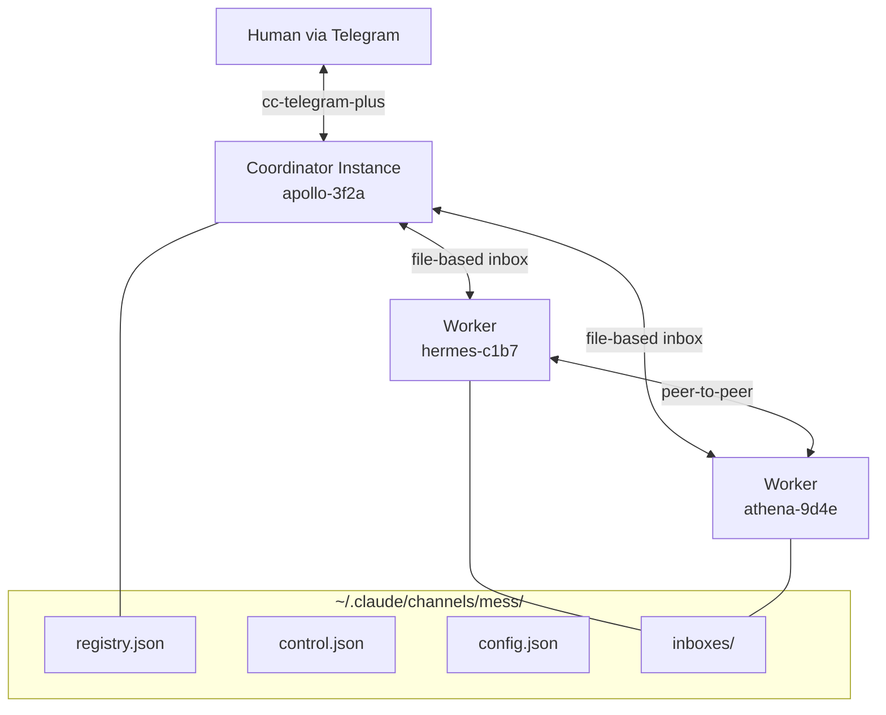

<p align="center">
  
</p>

# cc-mess

Inter-Claude-Code communication plugin — mesh networking for multiple Claude Code instances. Enables discovery, communication, task delegation, and emergent trust relationships using a file-based transport layer and symmetric peer architecture.

## Architecture



## Setup

### 1. Build cc-mess

```bash
cd /path/to/cc-mess
npm install
npm run build
```

### 2. Add to your project

In your project directory, create `.mcp.json`:

```json
{
  "mcpServers": {
    "cc-mess": {
      "command": "node",
      "args": ["/path/to/cc-mess/dist/server.js"],
      "env": {}
    }
  }
}
```

### 3. Configure the mesh

Create `~/.claude/channels/mess/config.json`:

```json
{
  "allowed_directories": ["/path/to/your/projects/*"],
  "max_instances": 10,
  "max_spawn_depth": 3,
  "require_telegram_relay": false,
  "default_guardrail": "permissive"
}
```

Set `require_telegram_relay: true` if you want to enforce Telegram visibility before workers can be spawned.

### 4. Pre-allow MCP tools

In your project's `.claude/settings.json`:

```json
{
  "permissions": {
    "allow": [
      "mcp__cc-mess__list_instances",
      "mcp__cc-mess__send",
      "mcp__cc-mess__broadcast",
      "mcp__cc-mess__reply",
      "mcp__cc-mess__spawn",
      "mcp__cc-mess__kill",
      "mcp__cc-mess__update_self",
      "mcp__cc-mess__mesh_control",
      "mcp__cc-mess__send_as_human"
    ]
  }
}
```

## Running

### Start the coordinator

The `--dangerously-load-development-channels server:cc-mess` flag is required for instances to receive messages from each other. Without it, MCP tools work but channel notifications (inbound messages) are silently dropped.

```bash
CC_MESS_ROLE=coordinator claude --dangerously-load-development-channels server:cc-mess
```

### Start a worker (interactive)

In another terminal, from the same project directory:

```bash
CC_MESS_ROLE=worker claude --dangerously-load-development-channels server:cc-mess
```

### Start a worker (one-shot task)

```bash
CC_MESS_ROLE=worker claude --dangerously-load-development-channels server:cc-mess \
  "You are a mesh worker. Call list_instances to see the mesh, then do your assigned task."
```

### Tmux dashboard

Launch a full dashboard with coordinator, viewer, and auto-created worker panes:

```bash
npm run dashboard -- --no-telegram --clean
```

- `--no-telegram` — disable the Telegram relay requirement for spawning
- `--clean` — wipe previous mesh state (registry, inboxes, audit) and start fresh

Workers spawned from the coordinator automatically appear as interactive panes in the dashboard.

### Conversation viewer

View the message timeline between instances:

```bash
npm run viewer                    # show all messages
npm run viewer -- --follow        # live-tail new messages
npm run viewer -- --last 20       # show last 20 messages
npm run viewer -- --from hermes   # filter by sender
```

### Spawn a worker from the coordinator

Inside the coordinator session:

```
spawn(cwd: "/path/to/project", task: "Refactor the auth module")
```

This launches a new Claude Code process with the cc-mess plugin injected automatically.

## MCP Tools

| Tool | Purpose |
|------|---------|
| `send` | Send a message to a specific instance by name |
| `broadcast` | Send a message to all instances (or filtered subset) |
| `reply` | Reply to a received message (threads via `in_reply_to`) |
| `list_instances` | Show the current registry — who's alive, what they're doing |
| `spawn` | Launch a new Claude Code instance with a task |
| `kill` | Ask an instance to gracefully shut down |
| `update_self` | Update own registry entry (task, capabilities) |
| `mesh_control` | Pause, resume, or shut down the entire mesh (coordinator only) |
| `send_as_human` | Route a Telegram message to an instance as the human (coordinator only) |

## Telegram Integration

The coordinator can relay mesh events to Telegram via [cc-telegram-plus](https://github.com/yaniv-golan/cc-telegram-plus). See [`docs/coordinator-claude-md.md`](docs/coordinator-claude-md.md) for the CLAUDE.md template that enables:

- Auto-relay of spawns, exits, crashes, task delegation, and results
- Human-to-instance messaging via `@name` prefix
- `/mess` commands (status, kill, spawn, pause, resume, shutdown_all, logs, verbosity)

### Relay config

Create `~/.claude/channels/mess/relay.json`:

```json
{
  "chat_id": "your-telegram-chat-id",
  "verbosity": "normal"
}
```

Verbosity levels: `quiet` (errors only), `normal` (spawns, exits, tasks), `verbose` (everything including chat).

## Configuration Reference

| Key | Type | Default | Description |
|-----|------|---------|-------------|
| `allowed_directories` | `string[]` | `[]` | Glob patterns for valid spawn locations |
| `max_instances` | `number` | `10` | Hard cap on total mesh size |
| `max_spawn_depth` | `number` | `3` | Maximum spawn chain depth |
| `require_telegram_relay` | `boolean` | `true` | Require active Telegram relay for spawning |
| `default_guardrail` | `string` | `"permissive"` | Default guardrail profile for spawned instances |

## Guardrail Profiles

- **`strict`** — Read-only. Allows `Read`/`Glob`/`Grep` within cwd, limited Bash commands, blocks writes/web access. For review tasks and code analysis.
- **`permissive`** — Full development sandbox. Allows read/write within cwd, Bash (except `git push`), package registry access. For implementation tasks.
- **`custom`** — Inline tool-level policies specified at spawn time via `custom_policies`.

## Transport

All state lives under `~/.claude/channels/mess/`. File-based message queues with atomic writes (temp + rename), lockfile-protected registry, and at-least-once delivery with persistent deduplication.

## Development

```bash
npm install
npm run build      # Compile TypeScript
npm run dev        # Watch mode
npm run test       # Run tests (114 tests)
npm run lint       # Lint
npm run typecheck  # Type check
```

## License

MIT
