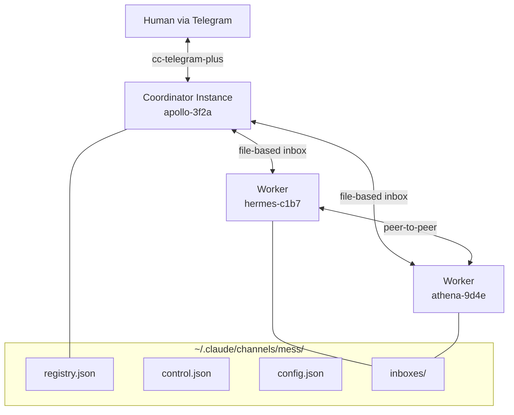

# cc-mess

Inter-Claude-Code communication plugin — mesh networking for multiple Claude Code instances. Enables discovery, communication, task delegation, and emergent trust relationships using a file-based transport layer and symmetric peer architecture.

## Architecture



## Installation

```bash
npm install cc-mess
```

## Quick Start

1. **Configure** — Create `~/.claude/channels/mess/config.json`:

   ```json
   {
     "allowed_directories": ["/path/to/your/projects/*"],
     "max_instances": 10,
     "max_spawn_depth": 3,
     "require_telegram_relay": true,
     "default_guardrail": "permissive"
   }
   ```

2. **Start the coordinator** — Launch Claude Code with cc-mess and cc-telegram-plus plugins. The coordinator registers itself and begins relaying mesh events to Telegram.

3. **Spawn workers** — Use the `spawn` tool to launch worker instances:

   ```
   spawn(cwd: "/path/to/project", task: "Refactor the auth module")
   ```

## MCP Tools

| Tool | Purpose |
|------|---------|
| `send` | Send a message to a specific instance by name |
| `broadcast` | Send a message to all instances (or filtered subset) |
| `reply` | Reply to a received message (threads via `in_reply_to`) |
| `list_instances` | Show the current registry — who's alive, what they're doing |
| `spawn` | Launch a new Claude Code instance with a task |
| `kill` | Ask an instance to gracefully shut down |
| `update_self` | Update own registry entry (task, capabilities) |

## Configuration Reference

| Key | Type | Default | Description |
|-----|------|---------|-------------|
| `allowed_directories` | `string[]` | `[]` | Glob patterns for valid spawn locations |
| `max_instances` | `number` | `10` | Hard cap on total mesh size |
| `max_spawn_depth` | `number` | `3` | Maximum spawn chain depth |
| `require_telegram_relay` | `boolean` | `true` | Require active Telegram relay for spawning |
| `default_guardrail` | `string` | `"permissive"` | Default guardrail profile for spawned instances |

## Guardrail Profiles

- **`strict`** — Read-only. Allows `Read`/`Glob`/`Grep` within cwd, limited Bash commands, blocks writes/web access. For review tasks and code analysis.
- **`permissive`** — Full development sandbox. Allows read/write within cwd, Bash (except `git push`), package registry access. For implementation tasks.
- **`custom`** — Inline tool-level policies specified at spawn time.

## Transport

All state lives under `~/.claude/channels/mess/`. File-based message queues with atomic writes (temp + rename), lockfile-protected registry, and at-least-once delivery with persistent deduplication.

## Development

```bash
npm install
npm run dev        # Watch mode
npm run test       # Run tests
npm run lint       # Lint
npm run typecheck  # Type check
```

## License

MIT
